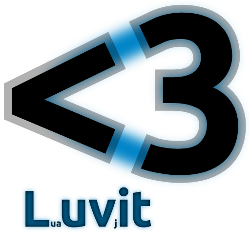

# Learning from Past Mistakes

## A New Node HTTP Layer

By Tim Caswell


## BackStory

 - I've contributed to node.js since the very beginning.
 - I helped design the API in the official node "http" module.
 - I architected the "connect" middleware system used by Express.js.
 - I've seen the rise and fall of many web frameworks.


## What was Wrong with Node

 - Callbacks are hard.
 - Streams leak events.
 - HTTP route layers are hard to compose.
 - Websocket requests do not emit "request" events.
 - Proper error handling was near impossible.
 - Servers would often be unstable.


## Change is Hard

 - Node is used in production at many companies.
 - Changing APIs is *very* expensive.
 - Language changes were slow for the same reasons.
 - Nobody wants to break the web.


# Lua

## Tiny, Fast, and Coroutines!


## A Lua Experiment

 - I heard good things about Lua.
 - Lua is compatable with node.js style APIs
 - Lua has coroutines.


## HTTP Server

```lua
local http = require("http")

http.createServer(function (req, res)
  res.writeHead(200, {
    ["Content-Length"] = 12,
    ["Content-Type"] = "text/plain"
  })
  res.end("Hello World\n")
end).listen(8080)
```


## HTTP Client

```lua
local http = require('http')

local req = http.request({
  host = "luvit.io",
  port = 80, path = "/"
}, function (res)
  res:on('data', function (chunk)
    p("ondata", {chunk=chunk})
  end)
end)
req:done()
```


## Faux Blocking on I/O

```lua
local data = await(fs.readFile("myfile.txt"))
local sql = "SELECT * FROM people"
local result = await(db.query(sql))

print(data, result)
```


## Luvit was Born

<a href="http://luvit.io/">

</a>


# Continuables

## How I wish node callbacks worked.


## Continuable

 - This is a function that has one parameter, the continuation function.
 - It represents an async action that does not return immediately.
 - Halfway between node-style callbacks and promise abstractions.

```javascript
var continuable = fs.readFile("myfile.txt");
continuable(function (err, data) {
  // This block is the continuation
});
```


## Continuable

 - Since the callback isn't the last arg in the original call, optional args are much easier to implement.
 - Having a return value you can manipulate control-flow helpers much easier to write.


## Continuation

 - The continuation is a normal node.js style callback.
 - Continuations *may* be called before the continuable returns.
 - This makes things easier for implementors of continuables.
 - But consumers need to take care.

```javascript
function readFile(path) {
  return function (callback) {
    fs.readFile(path, callback);   
  }
}
```


## $wait

 - When we have fibers we can do something awesome with these.
 - We can suspend the current fiber and resume it when the continuable resolves.
 - This gives us faux-blocking code.
 - But we're still single-threaded and non-blocking at the process level.


## $wait Example

```javascript
var Fiber = require('fibers');

// I use the $ prefix for functions that *may*
// suspend the current fiber.
var $wait = require('await');

Fiber(function () {
    var fd = $wait(fs.open("config.json", "r"));
    var readable = new fs.ReadStream(fd);
    var body = $wait(buffer(readable));
}).run();
```


## Unexpected State Changes

 - Shared state can change while a fiber is suspended.
 - Thus any function that can potentially suspend the fiber should be clearly marked.
 - I'm using function names that start with `$` in my code.
 - This makes fibers just as safe as callbacks.


# Simple Streams

## It's just an async queue


## Simple Streams

 - A readable stream is any object with a `.read()` function.
 - A writable stream is any object with a `.write(item)` function.
 - These functions return continuables.
 - A falsy value for `item` signifies the end of stream.


## Reading a File

```javascript
var fd = $wait(fs.open("myfile.txt", "r"));
var readable = new fs.ReadStream(fd);

var chunk;
while (chunk = $wait(readable.read())) {
  console.log("Chunk", chunk);
}
console.log("End of stream.");
```


## Reading a File (Cleaner)

```javascript
var fd = fs.$open("myfile.txt", "r");
var readable = new fs.ReadStream(fd);

var chunk;
while (chunk = readable.$read()) {
  console.log("Chunk", chunk);
}
console.log("End of stream.");
```


## Buffer a Stream

```small
function buffer(readable) {
  return function (callback) {
    var sync, parts = [];
    read();
    function read() {
      do {
        sync = undefined;
        readable.read()(onRead);
      } while (sync);
      sync = false;
    }
    function onRead(err, data) {
      if (err) return callback(err);
      if (!data) return callback(null, parts);
      parts.push(data);
      if (sync === undefined) { sync = true; }
      else { read(); }
    }
  };
}
```


## Buffer a Stream (Fibers)

```javascript
// Consumes all items in a stream
function $buffer(readable) {
  var chunk, parts = [];
  while (chunk = readable.$read()) {
    parts.push(chunk);
  }
  return parts;
}
```


## Pipe two Streams

```small
function pipe(readable, writable) {
  return function (callback) {
    var sync;
    read();
    function read() {
      do {
        sync = undefined;
        readable.read()(onRead);
      } while(sync);
      sync = false;
    }
    function onRead(err, data) {
      if (err) return callback(err);
      writable.write(data)(data ? onWrite : callback);
    }
    function onWrite(err) {
      if (err) return callback(err);
      if (sync === undefined) { sync = true; }
      else { read(); }
    }
  };
}
```


## Pipe two Streams (Fibers)

```javascript
function $pipe(readable, writable) {
  var chunk;
  do {
    chunk = readable.$read();
    writable.$write(chunk);
  } while(chunk);
}
```


## File Copy

```javascript
function streamCopy(from, to) {
  return function (callback) {
    fs.open(from, "r")(function (err, fd) {
      if (err) return callback(err);
      var readable = new fs.ReadStream(fd);
      fs.open(to, "w")(function (err, fd) {
        if (err) return callback(err);
        var writable = new fs.WriteStream(fd);
        pipe(readable, writable)(callback);
      });
    });
  };
}
```


## File Copy (Fibers)

```javascript
function $streamCopy(from, to) {
  var fd = fs.$open(from, "r");
  var readable = new fs.ReadStream(fd);
  fd = fs.$open(from, "w");
  var writable = new fs.WriteStream(fd);
  $pipe(readable, writable);
}
```


# HTTP Web API

## Decoupling Concerns


## Web App

 - Web is a new interface for HTTP apps.
 - It's just a special function.
 - There is no tie to TCP.
 - The web library accepts any arbitrary stream and serves a web app function.


## Hello Web

For simple responses, just return the body.

```javascript
function app(request) {
  return "Hello World";
}
```


## Custom Headers

If you want custom headers or status code, return an object.

```javascript
function app(request) {
  return {
    // status code
    code: 200,
    // headers
    "Server": "Alfred",
    // body
    body: "Hello World"
  };
}
```


## Streaming Body

If you want to stream the body, send a stream for the body.

```javascript
function app(request) {
  var readable = fs.$readStream("index.html");
  var stat = readable.$stat();
  return {
    "Content-Length": stat.length,
    body: readable
  };
}
```


## Returning a Continuable

If you're not into fibers and need to do async work before responding, return a continuable.

```javascript
function app(request) {
  return function (callback) {
    var continuable = fs.readFile("index.html");
    continuable(function (err, data) {
      if (err) return callback(err);
      return data;
    });
  };
}
```


## Wrapping an App

If you want to wrap an app to add some extra functionality, this is really easy.

```javascript
function log(app) {
  return function (request) {
    var response = $normalize(app(request));
    console.log(request.url,
                request.method,
                response.code);
    return response;
  };
}
```

`$normalize` resolves continuables and ensures the response is an object.


## Wrapping an App (Continuable)

There is a continuable version too

```javascript
function log(app) {
  return function (request) {
    return function (callback) {
      var continuable = normalize(app(request));
      continuable(function (err, response) {
        if (err) return callback(err);
        console.log(request.url, request.method,
                    response.code);
        callback(null, response);
      });
    };
  };
}
```


## Using the wrapper

Simply decorate the app with the wrapper.

```javascript
var app = function (request) {
  return "Hello World";
}

// Wrap the function in a new function.
var loggedApp = log(app);
```


## Hooking to a TCP server

Use the web library to convert your app function into a stream/socket handler.

```javascript
var web = require('web');
var tcp = require('continuable/tcp');

// Create a TCP server
var server = new tcp.Server();
server.listen(8080);

// Wrap our app in a socket handler
var app = require('./app');
var handler = web.wrap(app);
server.on('connection', handler);
```


# Current Status

## This is a work in progress.

 - Continuable style streams are implemented.
 - The `fibers` module on npm provides the fiber support.
 - The older web app specification is implemented, but needs porting to use continuables.


